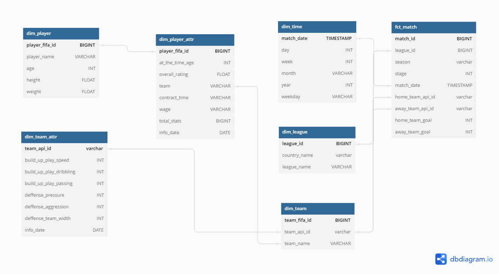
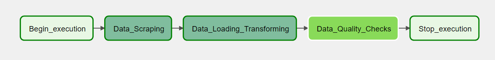

<<<<<<< HEAD
version https://git-lfs.github.com/spec/v1
oid sha256:9d270a929dacba52555e85550638106ea3febab66c47d68dbb0eee3dffda8200
size 5367
=======
# European Soccer Data Pipeline

## Introduction

This project is the final project of Udacity Data Engineering Nanodegree. I'm trying to use part of the technologies I've learned in the nandoegree.


## Project Summary

In this project I downloaded the provided sqlite database from this link ```https://www.kaggle.com/datasets/hugomathien/soccer```. I explored the data and decided to combine it with scraped data form ```https://sofifa.com``` to fit with the data model I decided on. After creating database and tables we will move to airflow pipeline and run it to scrape, transform and load data to PostgreSQL. 

## Used Technologies
1. Python
2. SQLite
3. PostgreSQL
4. Apache Airflow

## Exploring and Assessing Data

In this project I attached the thought process of mine in the ```Drafting and Exploring Data.ipynb```. I started by exploring the sqlite tables and assessing the previously loaded data. I even exported all tables to csv files as part of my process to help me understand the data. Once I understood it I decided on the data model which I'll be demonstrating in the next section. To make the model and data more flexible I decided to scrape players and teams data and merge it to the database as the teams and players data provided by the database from kaggle were missing important parts in my opinion. We will be selecting specific columns from some tables that fit better with our model.


## Data Model

Here is the database snowflake schema for European Soccer Database project 


We have 6 dimensions and one fact table as demonestrated above. Each player has some attributes over years so as teams have attributes for each one linked by date. I've decided that match will be the end table for me as it links all tables together. I tried to make this model as flecible to analytics as possible to increase performance and decrease time.

## Disclaimer
At first we should know that I modified the provided database from kaggle and cleansed the data a little bit before merging. I removed duplicates and ids conflicts as some of the players ids were having duplicated ids with different fifa id. Part of my data transformation was that I calculated the ages for all players from the birthday column. So the SQLite database attached to our project is not the original one from kaggle.


## Tables Creation and ETL
- As a prerequisite european_soccer database should be created.

### First Step
At the terminal:
1. ```python create_tables.py```

### Second Step
At airflow UI find:
1. ```fifa_dag.py```
run it and you should see something like this


The dag at first scrapes the data and exports two csv files ```scraped_players.csv``` and ```scraped_teams.csv``` we can find them at a relative path one folder back from dag folder.
After this the dag connects to our PostgreSQL previously created european_soccer database. Then it makes some transformations to the data, truncates the database tables then load data into our database.
After the previous step airflow will run Quality Checks task with the provided queries and results to make sure that our data were loaded successfuly.

### Third Step
This step is purely Analysis and Stats from our database. In the attached ```Exploratory Data Analysis.ipynb``` file you can find some analysis performed by me in the form of questions and answers to make it easier to any user to understand it well. 


## Project Write Up
At first I want to explain why I chose thos technologies used in this project. For starter I chose to use PostgreSQL as the end database because it has more features to it than SQLite and I have a better understanding for Postgres than SQLite. Before I went to Airflow choice I decided at first I will write raw python code to run the whole pipeline but I thought that it would be better if I could automate this process somehow. After moving to Airflow I noticed that the scraping script is taking less time at Airflow than the time it took from the raw python code so I completed the project with Airflow. For the Analysis part I felt that python along with sql is the better and fastest choice as we are interacting directly with the database.  

### What will we change if The data was increased by 100x ?!
For massive datasets we can go with a cloud based solution like Amazon S3 bucket.

### The pipelines would be run on a daily basis by 7 am every day ?!
I would schedule the Airflow dag to run daily at 7 am.

### The database needed to be accessed by 100+ people ?!
I researched the capabilities of PostgreSQL -users accessing wise- and found that it can handle up to 115 users. So I guess in this case we can stick to postgres or move to Amazon Redshift.


## Files Description

```database.sqlite```
Database after modification.

```fifa_dag.py```
The dag file that will be running on Airflow

```data_scraping.py```
Data scraping task imported into fifa dag.

```data_loading_trasforming.py```
Data loading and transforming task imported into fifa dag.

```data_quality.py```
Data quality checks imported into fifa dag.

```create_tables.sql```
Script to create database tables

```Drafting and Exploring Data.ipynb```
Notebook to illustrate the thought process of mine

```Exploratory Data Analysis.ipynb```
Notebook containing data analysis
>>>>>>> e7d4e6d7bbb6d3f4b836d0d815d92425898eb53d
